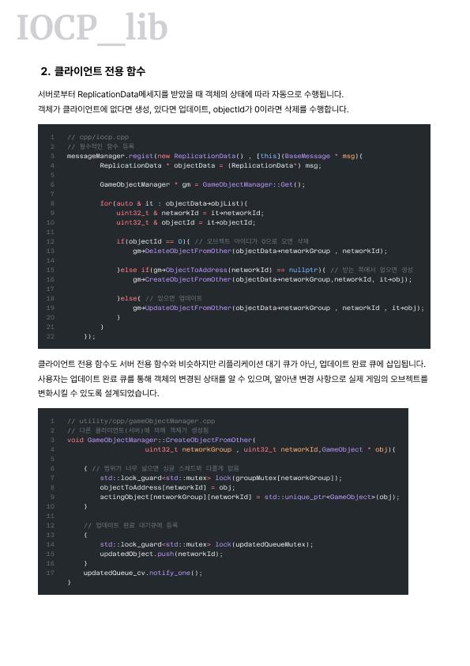

# IOCP_lib

<details>
<summary>IOCP_lib 서버_포트폴리오(펼쳐주세요)</summary>

[pdf로 펼치기](./ref/README.pdf)





</details>

## 1. IOCP_lib 소개 (Introduction)

**IOCP_lib**는 **C++17**을 기반으로 하는 게임 서버 제작용 **IOCP(I/O Completion Port) 네트워크 라이브러리**입니다.  

이 라이브러리는 팀 프로젝트 *Space_Quick_Delevery*에서 IOCP 서버를 처음 구현하며 겪었던 한계점을 극복하기 위해 시작되었습니다.  
프로젝트 종속적인 구조 때문에 코드 재사용과 확장이 어려웠고, 이를 해결하기 위해 복잡한 비동기 네트워크 로직과 객체 직렬화 과정을 추상화하여 **개발자가 핵심 콘텐츠 로직에 집중할 수 있는 범용 라이브러리**를 목표로 제작했습니다.  

---

## ✨ 주요 기능 (Features)

- **비동기 I/O 및 논블로킹 네트워크**  
  Windows IOCP API를 활용하여 수많은 클라이언트의 동시 접속을 최소한의 스레드로 효율적으로 처리  

- **RPC (원격 프로시저 호출) 시스템**  
  간단한 함수 등록만으로 클라이언트 요청 처리 가능 → 이벤트 처리 로직 단순화 및 유지보수성 향상  

- **리플렉션 기반 자동 직렬화 / 역직렬화**  
  기본 타입뿐 아니라 사용자 정의 클래스까지 별도의 직렬화 코드 없이 전송 가능  

- **객체 리플리케이션**  
  서버에서 관리하는 게임 오브젝트의 상태(생성, 소멸, 변경)가 관련 클라이언트와 자동 동기화 → 데이터 일관성 보장  

- **팩토리 패턴 기반 객체 관리**  
  GameObject 고유 ID만으로 객체 생성 가능 → 타입에 의존하지 않는 유연한 코드 작성  

---

## ⚙️ 시작하기 (Getting Started)

### 요구사항 (Prerequisites)

- 운영체제: Windows  
- 컴파일러: C++17 지원 (예: Visual Studio 2017 이상, MSYS2/MinGW g++)  
- 링커 라이브러리: `ws2_32`, `mswsock` (Windows 소켓 API)  

### 설치 (Installation)

본 라이브러리는 별도 빌드 없이 **소스/헤더 파일을 직접 프로젝트에 포함**해 사용합니다.  

1. 저장소의 `cpp`, `header`, `utility` 폴더를 프로젝트 폴더로 복사  
2. 빌드 시스템(예: Visual Studio, Makefile)에서 다음 설정 추가  
   - **소스 포함**: `cpp` 및 `utility/cpp` 폴더 내 `.cpp` 파일 전부 추가  
   - **헤더 경로**: `header`, `utility/header` 폴더 추가  
   - **링크 라이브러리**: `ws2_32`, `mswsock` 추가  

---

## 🚀 사용법 및 예제 코드 (Usage & API Examples)

### 1. 서버 생성 및 실행

```cpp
int main() {
    IocpServer iocp(9000); // 9000번 포트에서 실행

    if (iocp.Start()) {
        std::cout << "Server started on port 9000" << std::endl;
    } else {
        std::cout << "Failed to start server" << std::endl;
    }

    while (1) {
        std::string input;
        std::cin >> input;
        if (input == "exit") {
            iocp.Cleanup();
            break;
        }
    }
    return 0;
}
```

### 클라이언트 연결

```cpp
int main() {
    IocpClient client;
    client.Start();

    if (!client.Connect(GAME, "192.168.0.102", 9000)) { // 서버 9000번 포트 연결
        return 1;
    }

    while (true) {
        std::string msg;
        std::cout << "> ";
        std::cin >> msg;

        if (msg == "exit") {
            client.Cleanup();
            break;
        }
    }
    return 0;
}
```

---

### 2. RPC 함수 등록 및 호출

#### 공통: 메시지 정의

```cpp
class ChatMessage : public BaseMessage {
public:
    uint32_t sessionId;
    std::string chat;

    MESSAGE_IDENTIFICATION(21, ChatMessage)

    REFLECTABLE(ChatMessage,
        MemberVariable("sessionId", Type::Int32, OffsetOf(ChatMessage, sessionId)),
        MemberVariable("chat", Type::String, OffsetOf(ChatMessage, chat))
    )
};
```

#### 서버 측: RPC 정의 및 등록

```cpp
iocp.RpcRegist(new ChatMessage(), [&](BaseMessage* msg) {
    ChatMessage* cm = reinterpret_cast<ChatMessage*>(msg);

    auto connects = iocp.getConnect();
    for (auto it = connects.begin(); it != connects.end(); it++) {
        iocp.Send(it->first, cm);
    }
});
```

#### 클라이언트 측: RPC 호출

```cpp
std::shared_ptr<ChatMessage> cm = std::make_shared<ChatMessage>();

cm->sessionId = client.GetSessionId();
cm->chat = msg;

client.Send(GAME, cm);
```

---

### 3. 자동 직렬화를 위한 사용자 정의 클래스

메시지 내부에서 사용될 사용자 정의 클래스는 `BaseClass` 혹은 `GameObject`를 상속하여 사용 가능합니다.  

- **BaseClass 상속** → 일반적인 클래스에 적합  
- **GameObject 상속** → 게임 내 오브젝트 정보 처리용  

#### 예시 1: BaseClass 상속

```cpp
class Player : public BaseClass {
public:
    uint32_t mId;
    std::string mName;
    std::vector<uint32_t> mScore;

    REFLECTABLE(Player,
        MemberVariable("mId", Type::Int32, OffsetOf(Player, mId)),
        MemberVariable("mName", Type::String, OffsetOf(Player, mName)),
        MemberVariable("mScore", Type::Vector, OffsetOf(Player, mScore), Type::Int32)
    )
};
```

#### 예시 2: GameObject 상속

```cpp
class SampleObject : public GameObject {
public:
    int32_t hp;
    int32_t mp;
    float x, y, z;

    OBJECT_IDENTIFICATION(202020, SampleObject)

    REFLECTABLE(SampleObject,
        MemberVariable("hp", Type::Int32, OffsetOf(SampleObject, hp)),
        MemberVariable("mp", Type::Int32, OffsetOf(SampleObject, mp)),
        MemberVariable("x", Type::Float, OffsetOf(SampleObject, x)),
        MemberVariable("y", Type::Float, OffsetOf(SampleObject, y)),
        MemberVariable("z", Type::Float, OffsetOf(SampleObject, z))
    )
};
```

---

### 4. 객체 리플리케이션

`GameObject`를 상속받은 오브젝트는 `GameObjectRegistry`에 등록하고 사용할 수 있습니다.  
등록된 오브젝트들은 `GameObjectManager`에서 `생성`, `삭제`, `갱신` 관리가 가능하며, 변경이 발생하면 동일한 네트워크 그룹에 갱신 메시지를 발송합니다.  

#### 게임 오브젝트 등록

```cpp
GameObjectRegistry::Get()->RegistGameObject(new SampleObject());
```

#### 클라이언트: 네트워크 그룹 입장

```cpp
IntoNetworkGroup* into = new IntoNetworkGroup();
into->sessionId = client.GetSessionId();
into->networkGroup = room;

client.Send(GAME, into);
```

#### 클라이언트: 게임 오브젝트 변경 요청

```cpp
Chat* chat = new Chat();
chat->sessionId = client.GetSessionId();
chat->chat = "안녕하세용";

GameObjectWrapper* wrapper = new GameObjectWrapper();
wrapper->objectId = chat->GetObjectId();
wrapper->obj = chat;

CreateObjectOrder* order = new CreateObjectOrder();
order->sessionId = client.GetSessionId();
order->networkGroup = 202020;
order->wrapper = wrapper;

client.Send(GAME, order);
```

#### 서버: 객체 변경 요청 함수 등록

```cpp
iocp.RpcRegist(new CreateObjectOrder(), [&](BaseMessage* msg) {
    CreateObjectOrder* order = reinterpret_cast<CreateObjectOrder*>(msg);
    // 필요한 로직 작성
    GameObjectManager::Get()->CreateObject(order->networkGroup, order->wrapper->obj);
});
```

---

### 5. 아키텍처 및 핵심 개념 (Architecture & Core Concepts)

이 라이브러리는 확장성과 재사용성을 높이기 위해 각 기능을 계층화된 구조로 설계했습니다.  

#### 1. 비동기 네트워크 모델 (IOCP + AcceptEx)

- **IOCP (I/O Completion Port)**  
  소수의 워커 스레드만으로 수많은 클라이언트 소켓 I/O를 효율적으로 관리  
  완료된 작업 시에만 스레드가 동작하므로 CPU 컨텍스트 스위칭 비용 절감  

- **AcceptEx**  
  클라이언트 접속을 비동기적으로 처리 → 별도의 리슨 스레드 불필요, 리소스 절약 및 구조 단순화  

#### 2. 범용 직렬화 / 역직렬화 시스템

C++은 기본적으로 리플렉션을 지원하지 않기 때문에 임의 클래스 동적 처리에 어려움이 있습니다.  
이를 해결하기 위해 다음을 구현했습니다:  

- **MemoryStream**: 메모리 버퍼를 파일 스트림처럼 다루어 다양한 데이터 타입을 순차적으로 읽고 쓰기 가능  
- **팩토리 패턴 (Factory Pattern)**: 역직렬화 과정에서 타입 ID를 통해 등록된 객체를 생성 → 타입에 의존하지 않는 범용적 역직렬화 가능  

#### 3. 원격 프로시저 호출 (RPC)

switch-case 기반 메시지 처리의 종속성 문제를 해결하기 위해 RPC 시스템을 도입했습니다.  

- **MessageManager**: `std::map`과 `std::function`을 이용해 패킷 타입 ID와 처리 함수를 매핑  
- **동작 방식**: 워커 스레드가 수신 메시지를 확인하면 `MessageManager`에서 함수를 찾아 호출 → 네트워크 코드와 로직 코드 분리, 새로운 메시지 타입 추가 시 수정 최소화  

#### 4. 객체 리플리케이션

서버와 클라이언트 간 게임 상태를 자동 동기화하는 기능입니다.  

- **상태 변화 감지**: GameObject 상태가 바뀌면 네트워크 그룹의 리플리케이션 대기 큐에 등록  
- **자동 동기화**: 주기적으로 큐를 확인하고 변경 데이터를 관련 클라이언트에만 전송  
- **Wrapper 클래스**: 다양한 타입의 객체를 단일 배열로 관리하기 위해 Wrapper 도입 → 타입 ID와 포인터를 함께 저장해 이종 객체를 효율적으로 관리  

---

### 6. 폴더 구조

```
📦 IOCP
├─ cpp
├─ header
│  ├─ iocp.h
│  ├─ iocpClient.h
│  ├─ iocpServer.h
│  └─ session.h
└─ utility
   ├─ cpp
   └─ header
      ├─ baseClass.h
      ├─ baseMessage.h
      ├─ gameObject.h
      ├─ gameObjectManager.h
      ├─ inputMemoryStream.h
      ├─ memoryStream.h
      ├─ messageManager.h
      ├─ objectPool.h
      └─ outputMemoryStream.h
```

---

## 클래스 설명

### Iocp  
라이브러리의 본체 클래스. 서버와 클라이언트 연결을 관리하고, 직렬화, RPC, 수신 및 발신 등을 담당.  
- IocpClient  
- IocpServer  

### Session  
연결된 소켓을 관리하며 비동기 수신 및 발신 담당  

---

## Utility 파일 설명

- **BaseClass**  
  모든 직렬화 클래스가 상속해야 하는 기본 클래스  

- **MemoryStream**  
  직렬화/역직렬화 담당  
  - InputMemoryStream  
  - OutputMemoryStream  

- **MessageManager**  
  메시지 등록 및 RPC 관리, 리플리케이션 처리  

- **GameObjectManager**  
  싱글톤 객체 관리자. 객체의 생성/삭제/갱신을 담당  
